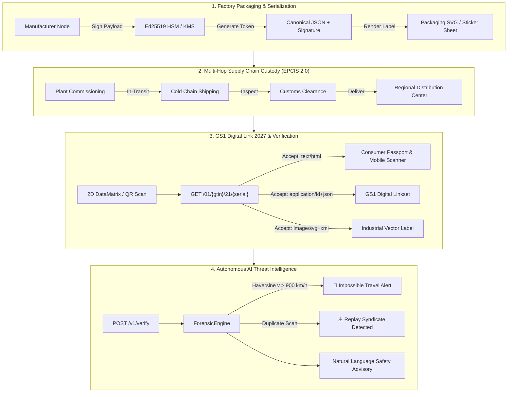

# OPAP Technical Protocol // Enterprise Edition

[](https://opensource.org/licenses/Apache-2.0)
[](https://www.python.org/)
[](https://fastapi.tiangolo.com)
[](https://www.gs1.org/standards/Digital-Link)
[](https://commission.europa.eu)
[](tests/)

**Open Product Authentication Protocol (OPAP)** is a commercial-grade, open-standard platform for cryptographic brand protection, anti-counterfeiting, supply chain track-and-trace, and regulatory compliance.

Benchmarked against global mandates—including **GS1 Digital Link (Sunrise 2027)**, **EU ESPR Digital Product Passport (EU 2024/1781)**, **EU Battery Regulation (EU 2023/1542)**, **GS1 EPCIS 2.0**, and **FDA DSCSA**—OPAP bridges physical serialization with mathematical authenticity.

---

## 🏛️ Enterprise Pillars & Standards

| Enterprise Pillar | Standard / Specification | Key Capabilities |
|---|---|---|
| **GS1 Digital Link Resolver** | GS1 URI Syntax Standard v1.7.0 (Sunrise 2027) | Native `/01/{gtin}/21/{serial}` resolver, GTIN-14 Modulo 10 check digit validation, Application Identifiers (`01`, `21`, `10`, `17`), dynamic content negotiation (HTML, JSON-LD, SVG). |
| **Offline V-Pass Verification** | Air-Gapped Attestation Tokens | 100% offline cryptographic verification for customs & field inspectors with compact URL-safe signed tokens (`OPAP.V1...`) and tamper-evident inspection proof receipts. |
| **Key Transparency & Merkle Ledger** | RFC 7517 JWKS & RFC 6962 Merkle Log | Open public key directory (`/.well-known/jwks.json`), Certificate Revocation Lists (CRL), and SHA-256 Merkle root hash for provable non-repudiation. |
| **Multi-Sector EU DPP 2.0** | CIRPASS / EU 2024/1781 / EU 2023/1542 | Tailored schemas for **Batteries** (SoH, chemistry, raw minerals), **Textiles** (fiber, wash cycles, PFAS-free), **Electronics** (French repairability index), and **Pharma** (cold-chain, serialization). |
| **EPCIS 2.0 Supply Chain Custody** | GS1 EPCIS 2.0 / CBV 2.0 Standard | Multi-hop custody logging (`COMMISSIONING`, `SHIPPING`, `CUSTOMS_CLEARANCE`, `RECEIVING`, `HOLDING`, `RETAIL_SELLING`), GLN locations, bulk JSON-LD document ingest (`/v1/epcis/capture`), and export. |
| **AI Forensics & Graph Network** | Autonomous Behavioral Intelligence | Real-time Haversine impossible travel geo-velocity ($v > 900\text{ km/h}$) anomaly detection, replay attack clustering, interactive topology graph export, and natural language safety advisories. |
| **Industrial Packaging Engine** | ISO/IEC 15424 Vector Printing | Print-ready industrial SVG packaging labels with cut guides and QR DataMatrix, plus multi-up batch sticker sheets for automated factory roll & sheet applicators. |
| **Cryptographic Foundation** | Ed25519 & Pluggable KMS/HSM | Canonical UTF-8 JSON signing, SHA-256 digest, dual-lane state machine (`MERCHANT` / `CONSUMER`), and pluggable signing providers (LocalEnv, FileKey, AWS KMS, GCP KMS, PKCS#11 HSM). |


---

## 🏗️ System Architecture



---

## ⚡ 5-in-1 Web Operations Center (`/`, `/ui`, `/scanner`)

A high-performance, single-page web dashboard with **zero external CDN dependencies**:

1. **📱 Camera Scanner**: Live hardware-accelerated QR decoding with `BarcodeDetector` API, file upload, clipboard paste, and single-scan verification.
2. **🇪🇺 Product Passport (DPP)**: Interactive EU ESPR compliance viewer displaying material composition breakdowns, carbon footprint, and circularity indicators.
3. **📦 EPCIS Custody Timeline**: Step-by-step audit trail visualizer with an inline custody transition submission form and standard JSON-LD exporter.
4. **🤖 AI Counterfeit Forensics**: Real-time surveillance feed tracking active impossible travel violations and replay attack clusters.
5. **⚡ Batch Audit**: High-speed table verifying up to 1,000 product tokens per request for bulk warehouse receiving.
6. **🧪 Protocol Sandbox**: One-click test environment to register demo manufacturers, issue signed product batches, and inspect hardware signers.

---

## 🚀 Quick Start

### Prerequisites
- Python 3.12+
- `uv` (recommended) or standard `pip`

### 1. Installation & Environment

```sh
# Clone repository
git clone https://github.com/BIGFERRY999/opap-protocol.git
cd opap-protocol

# Create virtual environment and install dependencies
uv venv
.\.venv\Scripts\activate  # Windows (or source .venv/bin/activate on Linux/macOS)
uv pip install -e .
```

### 2. Run Comprehensive Test Suite

```sh
pytest -v
```
*(All 15 unit and integration tests across GS1, DPP, EPCIS 2.0, AI Forensics, and Hardware Signers pass).*

### 3. Launch Development Server

```sh
uvicorn app.main:app --host 127.0.0.1 --port 8080 --reload
```

- **Web Operations Center**: Open `http://localhost:8080/ui`
- **Interactive OpenAPI Docs**: Open `http://localhost:8080/docs`

---

## 📡 API Reference Matrix

All administrative and issuance endpoints require the `X-API-Key` header (default dev key: `opap-dev-key-change-in-prod`).

### 1. GS1 Digital Link (Sunrise 2027)
- `GET /01/{gtin}/21/{serial}` — GS1 Digital Link resolver supporting dynamic content negotiation:
  - `Accept: text/html` → Redirects to interactive Consumer Passport UI.
  - `Accept: application/ld+json` → Returns GS1 linkset with links to DPP, verification, custody, and labels.
  - `Accept: image/svg+xml` → Returns high-density vector packaging label.

### 2. Digital Product Passport (EU ESPR 2024/1781)
- `GET /v1/products/{product_id}/dpp` — Returns full EU circularity metadata, materials composition, carbon footprint, repairability index, compliance certificates, and Ed25519 cryptographic seal verification.

### 3. GS1 EPCIS 2.0 Custody & Traceability
- `POST /v1/products/{product_id}/custody` — Records an immutable supply chain custody transition (`SHIPPING`, `CUSTOMS_CLEARANCE`, `RECEIVING`, etc.).
- `GET /v1/products/{product_id}/custody` — Fetches the product custody audit trail.
- `GET /v1/products/{product_id}/custody?format=epcis` — Exports a standardized GS1 EPCIS 2.0 JSON-LD document.

### 4. Autonomous AI Counterfeit Intelligence
- `GET /v1/products/{product_id}/forensics` — Computes product-level threat scoring, replay counts, impossible travel anomalies, and natural language advisories.
- `GET /v1/forensics/threats` — Global AI surveillance feed aggregating active anomalous events across the supply chain.

### 5. Industrial Packaging & Printing
- `GET /v1/products/{product_id}/label.svg` — Generates a print-ready vector label (SVG) with cut guides, GS1 human-readable text, and 2D QR DataMatrix.
- `GET /v1/manufacturers/{manufacturer_id}/labels/sheet` — Generates a print-ready HTML/PDF multi-up sticker grid formatted for standard A4 industrial roll & sheet applicators.

### 6. Core Authentication & Dual-Lane State Machine
- `POST /v1/manufacturers` — Registers an authorized manufacturer and Ed25519 public key.
- `POST /v1/manufacturers/{id}/products` — Issues 1–5,000 uniquely serialized, cryptographically signed product items.
- `POST /v1/verify` — Consumes an independent one-time verification lane (`MERCHANT` or `CONSUMER`).
- `POST /v1/verify/batch` — Bulk verifies up to 1,000 product tokens in an atomic operation.
- `GET /v1/signer` — Inspects the active cryptographic signing provider (`env`, `file`, `aws_kms`, `gcp_kms`, `pkcs11`).

---

## 🔐 Hardware Signer Configuration

OPAP abstracts cryptographic signing behind the `SignerProvider` interface (`app/signer.py`). Set `OPAP_SIGNER_PROVIDER` in your environment:

- **`env`** (Default): In-memory Ed25519 private key from `OPAP_SIGNING_PRIVATE_KEY_HEX`.
- **`file`**: Key file loaded from `OPAP_SIGNING_KEY_PATH` (supports 32-byte raw binary, 64-char hex, or PKCS#8 PEM).
- **`aws_kms`**: Hardware-backed asymmetric signing via AWS KMS Ed25519 key ID (`OPAP_AWS_KMS_KEY_ID`).
- **`gcp_kms`**: Hardware-backed asymmetric signing via Google Cloud KMS (`OPAP_GCP_KMS_KEY_NAME`).
- **`pkcs11`**: Direct HSM integration via PKCS#11 driver (`OPAP_PKCS11_LIB`, `OPAP_PKCS11_TOKEN_LABEL`, `OPAP_PKCS11_PIN`).

---

## 📜 Standards & Compliance References

- **GS1 Digital Link URI Syntax Standard v1.7.0**: [gs1.org/standards/Digital-Link](https://www.gs1.org/standards/Digital-Link)
- **EU Ecodesign for Sustainable Products Regulation (ESPR) (EU) 2024/1781**: [eur-lex.europa.eu/eli/reg/2024/1781/oj](https://eur-lex.europa.eu/eli/reg/2024/1781/oj)
- **GS1 EPCIS 2.0 & CBV 2.0 Standard**: [gs1.org/standards/epcis](https://www.gs1.org/standards/epcis)
- **RFC 8032**: Edwards-Curve Digital Signature Algorithm (Ed25519)
- **FDA Drug Supply Chain Security Act (DSCSA)**: Track-and-trace requirements for pharmaceutical supply chains.

---

## 📄 License

OPAP Protocol is released under the **Apache 2.0 License**. See [LICENSE](LICENSE) for details.
